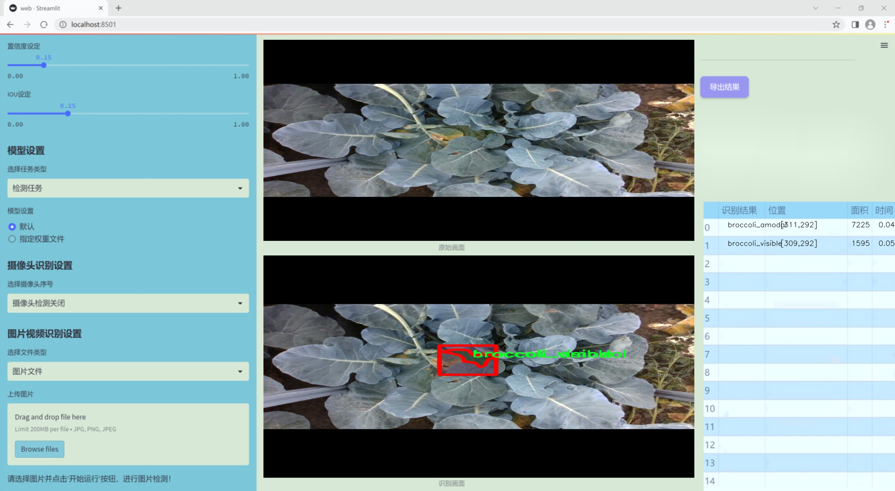

### 1.背景意义

研究背景与意义

随着计算机视觉技术的迅猛发展，实例分割作为一种重要的图像分析任务，逐渐在多个领域中展现出其独特的应用价值。实例分割不仅能够识别图像中的物体，还能精确地分割出每个物体的轮廓，这在农业、医疗影像分析、自动驾驶等领域具有广泛的应用前景。特别是在农业领域，作物的精准识别与分割对于提高产量、优化资源配置以及实现智能化管理具有重要意义。

西兰花作为一种重要的经济作物，其生长状况直接影响到农民的收入和市场供应。因此，开发一种高效的西兰花实例分割系统，能够帮助农民及时监测作物生长情况，进行病虫害防治，并优化收割时机。为此，基于改进YOLOv11的西兰花实例分割系统应运而生。YOLO（You Only Look Once）系列模型以其快速的检测速度和较高的精度，成为实例分割领域的热门选择。通过对YOLOv11进行改进，可以进一步提升其在复杂环境下的分割性能，尤其是在处理不同生长阶段和不同光照条件下的西兰花图像时。

本研究所使用的数据集包含1900张图像，涵盖了两类西兰花实例：可见的西兰花和不可见的西兰花。这种细致的分类不仅有助于模型的训练和评估，也为后续的应用提供了丰富的数据支持。通过对这些数据的深入分析与处理，可以更好地理解西兰花的生长特征及其在不同环境下的表现，从而为农民提供科学的种植建议和决策支持。

综上所述，基于改进YOLOv11的西兰花实例分割系统的研究，不仅具有重要的理论意义，还能为实际农业生产提供切实可行的解决方案，推动农业智能化的发展。

### 2.视频效果

[2.1 视频效果](https://www.bilibili.com/video/BV1gWqwYdERF/)

### 3.图片效果




##### [项目涉及的源码数据来源链接](https://kdocs.cn/l/cszuIiCKVNis)**

注意：本项目提供训练的数据集和训练教程,由于版本持续更新,暂不提供权重文件（best.pt）,请按照6.训练教程进行训练后实现上图演示的效果。

### 4.数据集信息

##### 4.1 本项目数据集类别数＆类别名

nc: 2
names: ['broccoli_amodal', 'broccoli_visible']


该项目为【图像分割】数据集，请在【训练教程和Web端加载模型教程（第三步）】这一步的时候按照【图像分割】部分的教程来训练

##### 4.2 本项目数据集信息介绍

本项目数据集信息介绍

本项目所使用的数据集旨在支持改进YOLOv11的西兰花实例分割系统，特别关注于“broccoli merged”主题。该数据集包含两类主要对象，分别为“broccoli_amodal”和“broccoli_visible”。这两类的划分不仅有助于系统在不同场景下的表现优化，也为模型提供了更为细致的训练基础。

“broccoli_amodal”类别代表了西兰花的完整形态，包含了所有可能的可见和不可见部分。这一类别的设计旨在帮助模型学习如何识别西兰花在不同环境下的整体特征，尤其是在部分遮挡或不完整情况下的表现。通过引入这一类别，模型能够更好地理解西兰花的空间结构和形态变化，从而提升实例分割的准确性。

而“broccoli_visible”类别则专注于西兰花的可见部分，主要用于训练模型在理想条件下的表现。该类别的引入使得模型能够学习如何在清晰的视角下准确识别和分割西兰花的可见特征。这一数据集的设计理念是通过结合可见与不可见的实例，提升模型在实际应用中的鲁棒性和适应性。

整个数据集的构建不仅考虑了多样性和复杂性，还确保了数据的标注准确性，以便为YOLOv11的训练提供高质量的输入。通过这种方式，模型能够在面对真实世界中西兰花的各种形态和遮挡情况时，展现出更强的识别和分割能力。最终目标是实现一个高效且准确的西兰花实例分割系统，为农业自动化和智能化提供技术支持。


### 5.全套项目环境部署视频教程（零基础手把手教学）

[5.1 所需软件PyCharm和Anaconda安装教程（第一步）](https://www.bilibili.com/video/BV1BoC1YCEKi/?spm_id_from=333.999.0.0&vd_source=bc9aec86d164b67a7004b996143742dc)


[5.2 安装Python虚拟环境创建和依赖库安装视频教程（第二步）](https://www.bilibili.com/video/BV1ZoC1YCEBw?spm_id_from=333.788.videopod.sections&vd_source=bc9aec86d164b67a7004b996143742dc)

### 6.改进YOLOv11训练教程和Web_UI前端加载模型教程（零基础手把手教学）

[6.1 改进YOLOv11训练教程和Web_UI前端加载模型教程（第三步）](https://www.bilibili.com/video/BV1BoC1YCEhR?spm_id_from=333.788.videopod.sections&vd_source=bc9aec86d164b67a7004b996143742dc)


按照上面的训练视频教程链接加载项目提供的数据集，运行train.py即可开始训练



     Epoch   gpu_mem       box       obj       cls    labels  img_size
     1/200     20.8G   0.01576   0.01955  0.007536        22      1280: 100%|██████████| 849/849 [14:42<00:00,  1.04s/it]
               Class     Images     Labels          P          R     mAP@.5 mAP@.5:.95: 100%|██████████| 213/213 [01:14<00:00,  2.87it/s]
                 all       3395      17314      0.994      0.957      0.0957      0.0843

     Epoch   gpu_mem       box       obj       cls    labels  img_size
     2/200     20.8G   0.01578   0.01923  0.007006        22      1280: 100%|██████████| 849/849 [14:44<00:00,  1.04s/it]
               Class     Images     Labels          P          R     mAP@.5 mAP@.5:.95: 100%|██████████| 213/213 [01:12<00:00,  2.95it/s]
                 all       3395      17314      0.996      0.956      0.0957      0.0845

     Epoch   gpu_mem       box       obj       cls    labels  img_size
     3/200     20.8G   0.01561    0.0191  0.006895        27      1280: 100%|██████████| 849/849 [10:56<00:00,  1.29it/s]
               Class     Images     Labels          P          R     mAP@.5 mAP@.5:.95: 100%|███████   | 187/213 [00:52<00:00,  4.04it/s]
                 all       3395      17314      0.996      0.957      0.0957      0.0845


###### [项目数据集下载链接](https://kdocs.cn/l/cszuIiCKVNis)

### 7.原始YOLOv11算法讲解


##### YOLO11介绍

Ultralytics YOLO11是一款尖端的、最先进的模型，它在之前YOLO版本成功的基础上进行了构建，并引入了新功能和改进，以进一步提升性能和灵活性。
**YOLO11设计快速、准确且易于使用，使其成为各种物体检测和跟踪、实例分割、图像分类以及姿态估计任务的绝佳选择。**


**结构图如下：**


##### **C3k2**

**C3k2，结构图如下**


**C3k2，继承自类`C2f，其中通过c3k设置False或者Ture来决定选择使用C3k还是`**Bottleneck


**实现代码** **ultralytics/nn/modules/block.py**

##### C2PSA介绍

**借鉴V10 PSA结构，实现了C2PSA和C2fPSA，最终选择了基于C2的C2PSA（可能涨点更好？）**


**实现代码** **ultralytics/nn/modules/block.py**

##### Detect介绍

**分类检测头引入了DWConv（更加轻量级，为后续二次创新提供了改进点），结构图如下（和V8的区别）：**


### 8.200+种全套改进YOLOV11创新点原理讲解

#### 8.1 200+种全套改进YOLOV11创新点原理讲解大全

由于篇幅限制，每个创新点的具体原理讲解就不全部展开，具体见下列网址中的改进模块对应项目的技术原理博客网址【Blog】（创新点均为模块化搭建，原理适配YOLOv5~YOLOv11等各种版本）

[改进模块技术原理博客【Blog】网址链接](https://gitee.com/qunmasj/good)


#### 8.2 精选部分改进YOLOV11创新点原理讲解

###### 这里节选部分改进创新点展开原理讲解(完整的改进原理见上图和[改进模块技术原理博客链接](https://gitee.com/qunmasj/good)【如果此小节的图加载失败可以通过CSDN或者Github搜索该博客的标题访问原始博客，原始博客图片显示正常】


### 空间和通道重建卷积SCConv
参考该博客提出的一种高效的卷积模块，称为SCConv (spatial and channel reconstruction convolution)，以减少冗余计算并促进代表性特征的学习。提出的SCConv由空间重构单元(SRU)和信道重构单元(CRU)两个单元组成。

（1）SRU根据权重分离冗余特征并进行重构，以抑制空间维度上的冗余，增强特征的表征。

（2）CRU采用分裂变换和融合策略来减少信道维度的冗余以及计算成本和存储。

（3）SCConv是一种即插即用的架构单元，可直接用于替代各种卷积神经网络中的标准卷积。实验结果表明，scconvo嵌入模型能够通过减少冗余特征来获得更好的性能，并且显著降低了复杂度和计算成本。


SCConv如图所示，它由两个单元组成，空间重建单元(SRU)和通道重建单元(CRU)，以顺序的方式放置。具体而言，对于瓶颈残差块中的中间输入特征X，首先通过SRU运算获得空间细化特征Xw，然后利用CRU运算获得信道细化特征Y。SCConv模块充分利用了特征之间的空间冗余和通道冗余，可以无缝集成到任何CNN架构中，以减少中间特征映射之间的冗余并增强CNN的特征表示。

#### SRU单元用于空间冗余


为了利用特征的空间冗余，引入了空间重构单元(SRU)，如图2所示，它利用了分离和重构操作。

分离操作 的目的是将信息丰富的特征图与空间内容对应的信息较少的特征图分离开来。我们利用组归一化(GN)层中的比例因子来评估不同特征图的信息内容。具体来说，给定一个中间特征映射X∈R N×C×H×W，首先通过减去平均值µ并除以标准差σ来标准化输入特征X，如下所示:


其中µ和σ是X的均值和标准差，ε是为了除法稳定性而加入的一个小的正常数，γ和β是可训练的仿射变换。

GN层中的可训练参数\gamma \in R^{C}用于测量每个批次和通道的空间像素方差。更丰富的空间信息反映了空间像素的更多变化，从而导致更大的γ。归一化相关权重W_{\gamma} \in R^{C}由下面公式2得到，表示不同特征映射的重要性。


然后将经Wγ重新加权的特征映射的权值通过sigmoid函数映射到(0,1)范围，并通过阈值进行门控。我们将阈值以上的权重设置为1，得到信息权重W1，将其设置为0，得到非信息权重W2(实验中阈值设置为0.5)。获取W的整个过程可以用公式表示。


最后将输入特征X分别乘以W1和W2，得到两个加权特征:信息量较大的特征X_{1}^{\omega }和信息量较小的特征X_{2}^{\omega }。这样就成功地将输入特征分为两部分:X_{1}^{\omega }具有信息量和表达性的空间内容，而X_{2}^{\omega }几乎没有信息，被认为是冗余的。

重构操作 将信息丰富的特征与信息较少的特征相加，生成信息更丰富的特征，从而节省空间空间。采用交叉重构运算，将加权后的两个不同的信息特征充分结合起来，加强它们之间的信息流。然后将交叉重构的特征X^{\omega1}和X^{\omega2}进行拼接，得到空间精细特征映射X^{\omega}。从后过程表示如下：


其中⊗是逐元素的乘法，⊕是逐元素的求和，∪是串联。将SRU应用于中间输入特征X后，不仅将信息特征与信息较少的特征分离，而且对其进行重构，增强代表性特征，抑制空间维度上的冗余特征。然而，空间精细特征映射X^{\omega}在通道维度上仍然是冗余的。

#### CRU单元用于通道冗余


分割 操作将输入的空间细化特征X^{\omega}分割成两个部分，一部分通道数是\alpha C，另一部分通道数是(1-\alpha) C，随后对两组特征的通道数使用1 * 1卷积核进行压缩，分别得到X_{up}和X_{low}。

转换 操作将输入的X_{up}作为“富特征提取”的输入，分别进行GWC和PWC，然后相加得到输出Y1，将输入X_{low}作为“富特征提取”的补充，进行PWC，得到的记过和原来的输入取并集得到Y2。

融合 操作使用简化的SKNet方法来自适应合并Y1和Y2。具体说是首先使用全局平均池化将全局空间信息和通道统计信息结合起来，得到经过池化的S1和S2。然后对S1和S2做Softmax得到特征权重向量\beta _{1}和\beta _{2}，最后使用特征权重向量得到输出Y = \beta _{1}*Y_{1} + \beta _{2}*Y_{2}，Y即为通道提炼的特征。


### 9.系统功能展示

图9.1.系统支持检测结果表格显示

  图9.2.系统支持置信度和IOU阈值手动调节

  图9.3.系统支持自定义加载权重文件best.pt(需要你通过步骤5中训练获得)

  图9.4.系统支持摄像头实时识别

  图9.5.系统支持图片识别

  图9.6.系统支持视频识别

  图9.7.系统支持识别结果文件自动保存

  图9.8.系统支持Excel导出检测结果数据


### 10. YOLOv11核心改进源码讲解

#### 10.1 TransNext.py

下面是对给定代码的核心部分进行分析和详细注释的结果：

```python
try:
    # 尝试导入swattention模块和TransNext_cuda中的所有内容
    import swattention
    from ultralytics.nn.backbone.TransNeXt.TransNext_cuda import *
except ImportError as e:
    # 如果导入失败（例如，swattention模块或TransNext_cuda不可用），则执行以下代码
    from ultralytics.nn.backbone.TransNeXt.TransNext_native import *
    # 这里使用pass语句表示不执行任何操作，继续执行后面的代码
```

### 代码分析

1. **导入模块**：
   - 代码首先尝试导入 `swattention` 模块以及 `TransNext_cuda` 中的所有内容。这表明程序依赖于这些模块来实现某些功能。
   - `swattention` 可能是一个用于实现注意力机制的库，而 `TransNext_cuda` 可能是一个基于CUDA的深度学习模型的实现，能够利用GPU加速计算。

2. **异常处理**：
   - 使用 `try...except` 结构来处理可能出现的导入错误。如果 `swattention` 或 `TransNext_cuda` 不可用，程序不会崩溃，而是会转向 `except` 块。
   - 在 `except` 块中，程序将尝试导入 `TransNext_native`，这是一个可能不依赖于CUDA的实现，适用于没有GPU或CUDA环境的情况。

3. **容错性**：
   - 这种导入方式提高了代码的容错性，使得即使在某些环境中缺少特定的依赖，程序仍然能够运行，虽然可能会使用性能较低的实现。

### 结论
这段代码的核心功能是根据可用的模块动态选择导入不同的实现，确保程序在不同环境下的兼容性和稳定性。

这个程序文件名为 `TransNext.py`，其主要功能是导入与深度学习相关的模块。首先，代码尝试导入名为 `swattention` 的库，这可能是一个与注意力机制相关的模块，通常在深度学习模型中用于增强模型对特定特征的关注能力。

接下来，代码尝试从 `ultralytics.nn.backbone.TransNeXt` 包中导入 `TransNext_cuda` 模块。这个模块可能是一个基于 CUDA 的实现，旨在利用 GPU 加速深度学习模型的训练和推理过程。CUDA 是一种由 NVIDIA 提供的并行计算平台和编程模型，能够显著提高计算性能。

如果在导入 `swattention` 或 `TransNext_cuda` 时发生 `ImportError`（即模块未找到的错误），程序会捕获这个异常，并尝试导入 `TransNext_native` 模块。这个模块可能是 `TransNext` 的一个纯 Python 实现，适用于没有 CUDA 支持的环境。这种设计允许程序在不同的环境中灵活运行，确保即使在没有 GPU 的情况下也能执行相关功能。

总的来说，这段代码的设计考虑到了不同的运行环境，确保了程序的兼容性和灵活性。通过尝试导入不同的模块，程序能够根据可用的资源选择最合适的实现，从而提高了其适用性。

#### 10.2 starnet.py

以下是经过简化和注释的核心代码部分：

```python
import torch
import torch.nn as nn
from timm.models.layers import DropPath, trunc_normal_

# 定义一个卷积层加批归一化的组合
class ConvBN(torch.nn.Sequential):
    def __init__(self, in_planes, out_planes, kernel_size=1, stride=1, padding=0, dilation=1, groups=1, with_bn=True):
        super().__init__()
        # 添加卷积层
        self.add_module('conv', torch.nn.Conv2d(in_planes, out_planes, kernel_size, stride, padding, dilation, groups))
        # 如果需要，添加批归一化层
        if with_bn:
            self.add_module('bn', torch.nn.BatchNorm2d(out_planes))
            # 初始化批归一化的权重和偏置
            torch.nn.init.constant_(self.bn.weight, 1)
            torch.nn.init.constant_(self.bn.bias, 0)

# 定义网络中的基本块
class Block(nn.Module):
    def __init__(self, dim, mlp_ratio=3, drop_path=0.):
        super().__init__()
        # 深度可分离卷积层
        self.dwconv = ConvBN(dim, dim, 7, 1, (7 - 1) // 2, groups=dim, with_bn=True)
        # 线性变换层
        self.f1 = ConvBN(dim, mlp_ratio * dim, 1, with_bn=False)
        self.f2 = ConvBN(dim, mlp_ratio * dim, 1, with_bn=False)
        self.g = ConvBN(mlp_ratio * dim, dim, 1, with_bn=True)
        self.dwconv2 = ConvBN(dim, dim, 7, 1, (7 - 1) // 2, groups=dim, with_bn=False)
        self.act = nn.ReLU6()  # 激活函数
        self.drop_path = DropPath(drop_path) if drop_path > 0. else nn.Identity()  # 随机深度

    def forward(self, x):
        input = x  # 保存输入
        x = self.dwconv(x)  # 经过深度可分离卷积
        x1, x2 = self.f1(x), self.f2(x)  # 线性变换
        x = self.act(x1) * x2  # 元素级乘法
        x = self.dwconv2(self.g(x))  # 经过另一个卷积层
        x = input + self.drop_path(x)  # 残差连接
        return x

# 定义StarNet网络
class StarNet(nn.Module):
    def __init__(self, base_dim=32, depths=[3, 3, 12, 5], mlp_ratio=4, drop_path_rate=0.0, num_classes=1000, **kwargs):
        super().__init__()
        self.num_classes = num_classes
        self.in_channel = 32
        # stem层，输入为3通道图像，输出为32通道
        self.stem = nn.Sequential(ConvBN(3, self.in_channel, kernel_size=3, stride=2, padding=1), nn.ReLU6())
        dpr = [x.item() for x in torch.linspace(0, drop_path_rate, sum(depths))]  # 随机深度
        self.stages = nn.ModuleList()  # 存储网络的各个阶段
        cur = 0
        for i_layer in range(len(depths)):
            embed_dim = base_dim * 2 ** i_layer  # 当前层的输出维度
            down_sampler = ConvBN(self.in_channel, embed_dim, 3, 2, 1)  # 下采样层
            self.in_channel = embed_dim
            blocks = [Block(self.in_channel, mlp_ratio, dpr[cur + i]) for i in range(depths[i_layer])]  # 添加Block
            cur += depths[i_layer]
            self.stages.append(nn.Sequential(down_sampler, *blocks))  # 将下采样层和Block组合成一个阶段
        
        self.apply(self._init_weights)  # 初始化权重

    def _init_weights(self, m):
        # 权重初始化
        if isinstance(m, (nn.Linear, nn.Conv2d)):
            trunc_normal_(m.weight, std=.02)  # 使用截断正态分布初始化权重
            if isinstance(m, nn.Linear) and m.bias is not None:
                nn.init.constant_(m.bias, 0)  # 初始化偏置为0
        elif isinstance(m, (nn.LayerNorm, nn.BatchNorm2d)):
            nn.init.constant_(m.bias, 0)
            nn.init.constant_(m.weight, 1.0)

    def forward(self, x):
        features = []  # 存储特征
        x = self.stem(x)  # 经过stem层
        features.append(x)
        for stage in self.stages:
            x = stage(x)  # 经过每个阶段
            features.append(x)
        return features  # 返回特征

# 定义不同规模的StarNet模型
def starnet_s1(pretrained=False, **kwargs):
    model = StarNet(24, [2, 2, 8, 3], **kwargs)
    return model

def starnet_s2(pretrained=False, **kwargs):
    model = StarNet(32, [1, 2, 6, 2], **kwargs)
    return model

def starnet_s3(pretrained=False, **kwargs):
    model = StarNet(32, [2, 2, 8, 4], **kwargs)
    return model

def starnet_s4(pretrained=False, **kwargs):
    model = StarNet(32, [3, 3, 12, 5], **kwargs)
    return model
```

### 代码说明：
1. **ConvBN类**：定义了一个包含卷积层和批归一化层的组合，用于构建网络的基本单元。
2. **Block类**：实现了StarNet的基本构建块，包含深度可分离卷积、线性变换和元素级乘法。
3. **StarNet类**：构建了整个网络结构，包括stem层和多个阶段，每个阶段由下采样层和多个Block组成。
4. **权重初始化**：使用截断正态分布初始化卷积层和线性层的权重，确保模型训练的稳定性。
5. **前向传播**：通过stem层和各个阶段计算特征，返回特征列表。

通过这些核心部分和注释，可以更好地理解StarNet的结构和功能。

这个程序文件实现了一个名为StarNet的深度学习网络，主要用于图像处理任务。StarNet的设计理念是尽量简化网络结构，以突出元素级乘法的关键贡献。文件中包含了网络的定义、各个模块的实现以及预训练模型的加载功能。

首先，程序导入了必要的库，包括PyTorch和一些自定义的层。接着，定义了一个字典`model_urls`，其中存储了不同版本StarNet模型的预训练权重的下载链接。

接下来，定义了一个`ConvBN`类，它是一个组合层，包含卷积层和批归一化层。这个类的构造函数接受多个参数，允许用户自定义卷积层的输入输出通道、卷积核大小、步幅、填充等。批归一化层的权重和偏置在初始化时被设置为特定的值。

然后，定义了一个`Block`类，表示StarNet中的基本构建块。每个Block包含一个深度卷积层、两个1x1卷积层、一个激活函数（ReLU6）和一个可选的DropPath层。前向传播过程中，输入经过深度卷积层后，分别通过两个1x1卷积层，经过激活函数后进行元素级乘法，最后通过另一个卷积层和残差连接返回。

`StarNet`类是整个网络的核心，包含了多个阶段的构建。它的构造函数接受基础维度、每个阶段的深度、MLP比率、DropPath率和类别数等参数。网络的第一层是一个stem层，后续的每个阶段由下采样层和多个Block组成。网络的权重在初始化时使用截断正态分布进行初始化。

文件还定义了多个函数，用于创建不同规模的StarNet模型（如starnet_s1、starnet_s2等）。这些函数允许用户选择是否加载预训练权重，若选择加载，则从指定的URL下载权重并加载到模型中。

最后，文件中还定义了一些非常小的网络版本（如starnet_s050、starnet_s100、starnet_s150），以适应不同的应用场景和计算资源限制。

整体而言，这个程序文件提供了一个灵活且高效的深度学习网络实现，适合用于图像分类等任务，并且通过简化设计突出了关键的网络结构特性。

#### 10.3 dynamic_snake_conv.py

以下是代码中最核心的部分，并附上详细的中文注释：

```python
import torch
import torch.nn as nn

class DySnakeConv(nn.Module):
    def __init__(self, inc, ouc, k=3) -> None:
        super().__init__()
        # 初始化三个卷积层
        self.conv_0 = Conv(inc, ouc, k)  # 标准卷积
        self.conv_x = DSConv(inc, ouc, 0, k)  # 沿x轴的动态蛇形卷积
        self.conv_y = DSConv(inc, ouc, 1, k)  # 沿y轴的动态蛇形卷积
    
    def forward(self, x):
        # 前向传播，返回三个卷积的拼接结果
        return torch.cat([self.conv_0(x), self.conv_x(x), self.conv_y(x)], dim=1)

class DSConv(nn.Module):
    def __init__(self, in_ch, out_ch, morph, kernel_size=3, if_offset=True, extend_scope=1):
        """
        动态蛇形卷积
        :param in_ch: 输入通道数
        :param out_ch: 输出通道数
        :param kernel_size: 卷积核大小
        :param extend_scope: 扩展范围（默认1）
        :param morph: 卷积核的形态，分为沿x轴（0）和y轴（1）
        :param if_offset: 是否需要偏移，如果为False，则为标准卷积核
        """
        super(DSConv, self).__init__()
        # 用于学习可变形偏移的卷积层
        self.offset_conv = nn.Conv2d(in_ch, 2 * kernel_size, 3, padding=1)
        self.bn = nn.BatchNorm2d(2 * kernel_size)  # 批归一化
        self.kernel_size = kernel_size

        # 定义沿x轴和y轴的动态蛇形卷积
        self.dsc_conv_x = nn.Conv2d(
            in_ch,
            out_ch,
            kernel_size=(kernel_size, 1),
            stride=(kernel_size, 1),
            padding=0,
        )
        self.dsc_conv_y = nn.Conv2d(
            in_ch,
            out_ch,
            kernel_size=(1, kernel_size),
            stride=(1, kernel_size),
            padding=0,
        )

        self.gn = nn.GroupNorm(out_ch // 4, out_ch)  # 组归一化
        self.act = Conv.default_act  # 默认激活函数

        self.extend_scope = extend_scope
        self.morph = morph
        self.if_offset = if_offset

    def forward(self, f):
        # 前向传播
        offset = self.offset_conv(f)  # 计算偏移
        offset = self.bn(offset)  # 批归一化
        offset = torch.tanh(offset)  # 将偏移限制在[-1, 1]之间
        input_shape = f.shape
        dsc = DSC(input_shape, self.kernel_size, self.extend_scope, self.morph)  # 初始化DSC
        deformed_feature = dsc.deform_conv(f, offset, self.if_offset)  # 进行可变形卷积
        
        # 根据形态选择不同的卷积
        if self.morph == 0:
            x = self.dsc_conv_x(deformed_feature.type(f.dtype))
        else:
            x = self.dsc_conv_y(deformed_feature.type(f.dtype))
        
        x = self.gn(x)  # 组归一化
        x = self.act(x)  # 激活
        return x

class DSC(object):
    def __init__(self, input_shape, kernel_size, extend_scope, morph):
        self.num_points = kernel_size  # 卷积核的点数
        self.width = input_shape[2]  # 输入特征图的宽度
        self.height = input_shape[3]  # 输入特征图的高度
        self.morph = morph  # 卷积核形态
        self.extend_scope = extend_scope  # 偏移范围

        # 定义特征图的形状
        self.num_batch = input_shape[0]  # 批次大小
        self.num_channels = input_shape[1]  # 通道数

    def deform_conv(self, input, offset, if_offset):
        # 进行可变形卷积
        y, x = self._coordinate_map_3D(offset, if_offset)  # 计算坐标图
        deformed_feature = self._bilinear_interpolate_3D(input, y, x)  # 双线性插值
        return deformed_feature  # 返回变形后的特征图
```

### 代码说明：
1. **DySnakeConv**: 这是一个动态蛇形卷积的主类，包含三个卷积层：标准卷积和两个沿不同方向的动态蛇形卷积。
2. **DSConv**: 动态蛇形卷积的实现类，包含学习偏移的卷积层和根据偏移进行变形卷积的逻辑。
3. **DSC**: 负责计算坐标图和进行双线性插值的类，提供了变形卷积的具体实现。

该代码的核心思想是通过动态学习卷积核的偏移，使得卷积操作能够适应输入特征图的形状变化，从而提高模型的表达能力。

这个程序文件定义了一个动态蛇形卷积（Dynamic Snake Convolution）模块，主要由两个类组成：`DySnakeConv` 和 `DSConv`，以及一个辅助类 `DSC`。这些类利用了深度学习框架 PyTorch 来实现卷积操作，特别是支持可变形卷积的功能。

首先，`DySnakeConv` 类是一个卷积神经网络模块，继承自 `nn.Module`。在其构造函数中，初始化了三个卷积层：`conv_0` 是标准卷积，`conv_x` 和 `conv_y` 是动态蛇形卷积，分别沿着 x 轴和 y 轴进行操作。构造函数的参数包括输入通道数 `inc`、输出通道数 `ouc` 和卷积核大小 `k`，默认值为 3。

在 `forward` 方法中，输入张量 `x` 会经过这三个卷积层，最终将它们的输出在通道维度上进行拼接，形成一个新的输出张量。

接下来是 `DSConv` 类，它实现了动态蛇形卷积的具体逻辑。构造函数中定义了几个重要的参数，包括输入和输出通道数、卷积核大小、形态（morph）以及是否需要偏移（if_offset）。其中，`offset_conv` 是一个卷积层，用于学习可变形的偏移量。`dsc_conv_x` 和 `dsc_conv_y` 分别是沿 x 轴和 y 轴的卷积层，`gn` 是一个组归一化层，`act` 是激活函数。

在 `DSConv` 的 `forward` 方法中，首先通过 `offset_conv` 计算出偏移量，并进行批归一化处理。然后，通过 `torch.tanh` 将偏移量限制在 -1 到 1 的范围内。接着，使用 `DSC` 类来进行坐标映射和可变形卷积操作。根据 `morph` 的值，选择相应的卷积层进行计算，并通过激活函数和归一化处理得到最终输出。

`DSC` 类是一个辅助类，负责实现坐标映射和双线性插值。它的构造函数接收输入张量的形状、卷积核大小、扩展范围和形态等参数。`_coordinate_map_3D` 方法根据偏移量计算出新的坐标映射，`_bilinear_interpolate_3D` 方法则实现了对输入特征图的双线性插值，生成变形后的特征图。

总的来说，这个程序文件实现了一个灵活的卷积模块，能够根据输入数据的特征动态调整卷积核的位置，从而提高卷积神经网络在处理复杂形状和结构时的表现。

#### 10.4 CTrans.py

以下是提取的核心代码部分，并附上详细的中文注释：

```python
import torch
import torch.nn as nn
import numpy as np
from torch.nn import Dropout, Softmax, Conv2d, LayerNorm

class Channel_Embeddings(nn.Module):
    """从图像的补丁和位置嵌入构建通道嵌入的类。"""
    def __init__(self, patchsize, img_size, in_channels):
        super().__init__()
        img_size = (img_size, img_size)  # 将图像大小转换为元组
        patch_size = (patchsize, patchsize)  # 将补丁大小转换为元组
        n_patches = (img_size[0] // patch_size[0]) * (img_size[1] // patch_size[1])  # 计算补丁数量

        # 使用最大池化和卷积层构建补丁嵌入
        self.patch_embeddings = nn.Sequential(
            nn.MaxPool2d(kernel_size=5, stride=5),
            Conv2d(in_channels=in_channels,
                    out_channels=in_channels,
                    kernel_size=patchsize // 5,
                    stride=patchsize // 5)
        )

        # 初始化位置嵌入
        self.position_embeddings = nn.Parameter(torch.zeros(1, n_patches, in_channels))
        self.dropout = Dropout(0.1)  # Dropout层用于防止过拟合

    def forward(self, x):
        """前向传播函数，计算嵌入。"""
        if x is None:
            return None
        x = self.patch_embeddings(x)  # 计算补丁嵌入
        x = x.flatten(2)  # 将张量展平
        x = x.transpose(-1, -2)  # 转置张量
        embeddings = x + self.position_embeddings  # 加上位置嵌入
        embeddings = self.dropout(embeddings)  # 应用Dropout
        return embeddings

class Attention_org(nn.Module):
    """实现多头注意力机制的类。"""
    def __init__(self, vis, channel_num):
        super(Attention_org, self).__init__()
        self.vis = vis  # 是否可视化
        self.KV_size = sum(channel_num)  # 键值对的大小
        self.channel_num = channel_num  # 通道数量
        self.num_attention_heads = 4  # 注意力头的数量

        # 初始化查询、键、值的线性变换
        self.query = nn.ModuleList([nn.Linear(c, c, bias=False) for c in channel_num])
        self.key = nn.Linear(self.KV_size, self.KV_size, bias=False)
        self.value = nn.Linear(self.KV_size, self.KV_size, bias=False)
        self.softmax = Softmax(dim=3)  # Softmax层用于计算注意力权重
        self.attn_dropout = Dropout(0.1)  # Dropout层用于注意力权重
        self.proj_dropout = Dropout(0.1)  # Dropout层用于输出

    def forward(self, emb_list):
        """前向传播函数，计算注意力输出。"""
        multi_head_Q_list = [query(emb) for query, emb in zip(self.query, emb_list)]
        multi_head_K = self.key(torch.cat(emb_list, dim=2))  # 计算键
        multi_head_V = self.value(torch.cat(emb_list, dim=2))  # 计算值

        # 计算注意力分数
        attention_scores = [torch.matmul(Q, multi_head_K) / np.sqrt(self.KV_size) for Q in multi_head_Q_list]
        attention_probs = [self.softmax(score) for score in attention_scores]  # 计算注意力权重

        # 应用Dropout
        attention_probs = [self.attn_dropout(prob) for prob in attention_probs]
        context_layers = [torch.matmul(prob, multi_head_V) for prob in attention_probs]  # 计算上下文层

        # 返回每个通道的输出
        return context_layers

class Encoder(nn.Module):
    """编码器类，包含多个块。"""
    def __init__(self, vis, channel_num):
        super(Encoder, self).__init__()
        self.vis = vis
        self.layer = nn.ModuleList([Block_ViT(vis, channel_num) for _ in range(1)])  # 仅包含一个块

    def forward(self, emb_list):
        """前向传播函数，处理嵌入。"""
        attn_weights = []
        for layer_block in self.layer:
            emb_list, weights = layer_block(emb_list)  # 通过块处理嵌入
            if self.vis:
                attn_weights.append(weights)
        return emb_list, attn_weights  # 返回处理后的嵌入和注意力权重

class ChannelTransformer(nn.Module):
    """通道变换器类，整合了嵌入、编码器和重构。"""
    def __init__(self, channel_num=[64, 128, 256, 512], img_size=640, vis=False, patchSize=[40, 20, 10, 5]):
        super().__init__()
        self.embeddings = nn.ModuleList([Channel_Embeddings(patchSize[i], img_size // (2 ** (i + 2)), channel_num[i]) for i in range(len(channel_num))])
        self.encoder = Encoder(vis, channel_num)  # 初始化编码器
        self.reconstruct = nn.ModuleList([Reconstruct(channel_num[i], channel_num[i], kernel_size=1, scale_factor=(patchSize[i], patchSize[i])) for i in range(len(channel_num))])

    def forward(self, en):
        """前向传播函数，处理输入并返回输出。"""
        emb_list = [embedding(en[i]) for i, embedding in enumerate(self.embeddings)]  # 计算嵌入
        encoded, attn_weights = self.encoder(emb_list)  # 编码嵌入
        reconstructed = [reconstruct(encoded[i]) + en[i] for i, reconstruct in enumerate(self.reconstruct)]  # 重构输出
        return reconstructed  # 返回重构后的输出
```

### 代码说明
1. **Channel_Embeddings**: 该类负责将输入图像分割成补丁并计算其嵌入，同时加入位置嵌入以保留空间信息。
2. **Attention_org**: 实现了多头注意力机制，能够处理多个通道的输入并计算注意力权重。
3. **Encoder**: 由多个块组成的编码器，负责对嵌入进行处理并输出结果。
4. **ChannelTransformer**: 整合了嵌入、编码器和重构模块，完成整个通道变换的流程。

通过这些核心部分，整个模型能够有效地处理图像数据并提取特征。

这个程序文件 `CTrans.py` 实现了一个名为 `ChannelTransformer` 的深度学习模型，主要用于图像处理任务。该模型采用了类似于视觉变换器（Vision Transformer, ViT）的结构，结合了通道注意力机制和嵌入层，旨在提升图像特征的提取和重建能力。

文件中首先导入了一些必要的库，包括 PyTorch 及其相关模块、NumPy 和其他标准库。接着定义了几个类，分别实现了不同的功能模块。

`Channel_Embeddings` 类用于构建图像的嵌入表示。它通过最大池化和卷积操作将输入图像划分为多个小块（patch），并为每个小块生成位置嵌入。最终的嵌入结果会经过一个 dropout 层，以减少过拟合。

`Reconstruct` 类负责将经过编码的特征重新构建为图像。它通过卷积层和上采样操作将嵌入特征转换回原始图像的空间维度，并应用批归一化和激活函数。

`Attention_org` 类实现了一个多头注意力机制。它通过对输入的不同通道进行线性变换，计算注意力得分，并根据得分对输入进行加权平均，从而提取重要特征。该类还包含了 dropout 层，以增强模型的鲁棒性。

`Mlp` 类实现了一个简单的多层感知机（MLP），用于对特征进行进一步的非线性变换。它包含两个全连接层和一个激活函数（GELU），并在每个层后应用 dropout。

`Block_ViT` 类是模型的核心部分，包含了通道注意力和前馈网络的组合。它通过残差连接将输入与经过注意力和前馈网络处理后的输出相加，从而保留了原始特征信息。

`Encoder` 类将多个 `Block_ViT` 组合在一起，形成一个完整的编码器。它在每个块后应用层归一化，以确保特征的稳定性。

`ChannelTransformer` 类是整个模型的高层接口，负责初始化嵌入层、编码器和重建层。它根据输入的图像特征进行嵌入、编码和重建，最终输出重建后的图像。

最后，`GetIndexOutput` 类用于从模型的输出中提取特定索引的结果，便于后续处理。

整体而言，这个程序实现了一个结构复杂但功能强大的图像处理模型，结合了卷积、注意力机制和多层感知机等多种深度学习技术，适用于各种计算机视觉任务。

### 11.完整训练+Web前端界面+200+种全套创新点源码、数据集获取


# [下载链接：https://mbd.pub/o/bread/Z5yYl51r](https://mbd.pub/o/bread/Z5yYl51r)